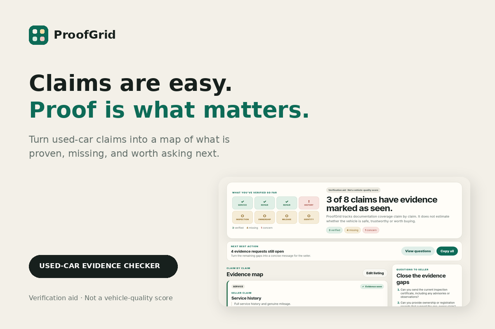

# ProofGrid

> **Claims are easy. Proof is what matters.**

ProofGrid is a local-first used-car evidence checker built for **Build With AI: Basics**. It turns seller claims into a transparent evidence map instead of generating an opaque trust score or purchase verdict.



## What it does

1. Paste a used-car listing or launch the guided demo.
2. ProofGrid extracts supported evidence-bearing claims.
3. Each claim is mapped to the documentation that would support it.
4. Mark each claim as **Missing**, **Evidence seen**, or **Concern**.
5. The **Proof Grid** updates claim by claim so uncertainty stays visible.
6. Copy a prioritized list of evidence questions to send to the seller.

ProofGrid deliberately does **not** claim to know whether a vehicle is safe, genuine, trustworthy, or worth buying.

> **Verification aid · Not a vehicle-quality score.**

## Run locally

Requires Node.js 20+.

```bash
node server.mjs
```

Open:

```text
http://127.0.0.1:4173
```

### Guided demo mode

```text
http://127.0.0.1:4173/?record=1
```

No npm install, API key, backend, database, or paid service is required.

## Run tests

```bash
node --test tests/*.test.js
```

Submission-preparation baseline: **12/12 tests passing**.

## Architecture

- HTML5 / CSS3
- JavaScript ES Modules
- Node.js lightweight local server
- Browser `localStorage`
- Deterministic claim rules and evidence mappings
- Node native test runner

The runtime uses no external AI API. AI was used as a development collaborator during planning, implementation, testing, debugging, and design review.

## Privacy

The proof of concept runs locally in the browser. Listing text is not uploaded to a ProofGrid backend. The latest analysis state is stored in browser `localStorage`.

## Current limitations

- English-focused deterministic extraction
- Bounded claim vocabulary
- “Evidence seen” is user-attested; ProofGrid does not authenticate documents
- Not a vehicle inspection, history report, legal opinion, valuation, or purchase recommendation

## Devpost Learn planning artifacts

Required planning documents are in [`devpost/`](./devpost/):

- [`scope.md`](./devpost/scope.md) — approved
- [`prd.md`](./devpost/prd.md) — approved
- [`spec.md`](./devpost/spec.md) — approved

Additional submission material:

- [`DEVPOST_SUBMISSION.md`](./DEVPOST_SUBMISSION.md)
- [`COMPLIANCE_AUDIT.md`](./COMPLIANCE_AUDIT.md)
- [`devpost/final-assets/`](./devpost/final-assets/)
- [`demo/`](./demo/)

## License

MIT — see [`LICENSE`](./LICENSE).
